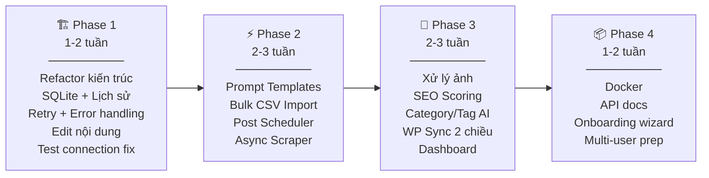

# 🎯 WordPress Agent — Feature Development Plan

> **Phương châm:** 1 người dùng, không phức tạp hoá, tập trung 100% vào tính năng có giá trị thực.
> Multi-user là mục tiêu tương lai — kiến trúc đặt nền sẵn nhưng chưa build auth/billing.

---

## Cấu Trúc Dự Án Sau Refactor

```
wordpressagent/
├── app.py                      # Entry point — khởi chạy server
├── ui/
│   ├── main_ui.py              # Gradio Blocks chính (tabs)
│   ├── tab_create.py           # Tab tạo & đăng bài
│   ├── tab_sites.py            # Tab quản lý website
│   ├── tab_templates.py        # Tab quản lý prompt template   ← MỚI
│   ├── tab_history.py          # Tab lịch sử đăng bài          ← MỚI
│   ├── tab_scheduler.py        # Tab lên lịch đăng              ← MỚI
│   └── tab_dashboard.py        # Tab dashboard tổng quan        ← MỚI
├── api/                        # FastAPI backend (internal)     ← MỚI
│   ├── main.py                 # FastAPI app + mount Gradio
│   ├── routes/
│   │   ├── generate.py         # POST /api/generate
│   │   ├── publish.py          # POST /api/publish
│   │   ├── sites.py            # CRUD /api/sites
│   │   ├── templates.py        # CRUD /api/templates
│   │   ├── history.py          # GET /api/history
│   │   └── scheduler.py        # CRUD /api/scheduled-jobs
│   └── dependencies.py
├── core/                       # Business logic (tách khỏi UI)  ← MỚI
│   ├── pipeline.py             # Orchestrator: search→scrape→write→publish
│   ├── searcher.py             # (chuyển từ modules/)
│   ├── scraper.py              # (chuyển + async hoá)
│   ├── ai_writer.py            # (chuyển từ modules/)
│   ├── image_processor.py      # Resize, xóa nền, watermark    ← MỚI
│   ├── seo_scorer.py           # Chấm điểm SEO                 ← MỚI
│   └── wp_client.py            # WP Publisher + Image Uploader (gộp)
├── db/                         # Database layer                  ← MỚI
│   ├── database.py             # SQLite engine + session
│   ├── models.py               # SQLAlchemy models
│   └── crud.py                 # Create/Read/Update/Delete
├── config/
│   ├── settings.py             # .env config (giữ nguyên)
│   └── defaults/
│       └── templates/          # Prompt templates mặc định      ← MỚI
│           ├── industrial.txt  # Thiết bị công nghiệp (hiện tại)
│           ├── electronics.txt # Điện tử
│           └── general.txt     # Đa dụng
├── prompts/
│   └── write_post.txt          # (Giữ tương thích, fallback)
├── requirements.txt
├── Dockerfile                  # Docker support                  ← MỚI
└── docker-compose.yml                                            ← MỚI
```

> [!NOTE]
> **Nguyên tắc refactor:** Tách UI ↔ Logic ↔ Data. Mỗi layer gọi layer bên dưới, không gọi ngược.
> `UI (Gradio)` → `API (FastAPI)` → `Core (business logic)` → `DB (SQLite)`
> Sau này muốn thay Gradio bằng React chỉ cần viết frontend mới gọi vào API, không đụng gì core.

---

## Phase 1 — Nền Móng & Fix Pain Points (1–2 tuần)

> Mục tiêu: Kiến trúc sạch, sửa hết vấn đề hiện tại, có lịch sử đăng bài.

### 1.1 Refactor kiến trúc: tách UI / Core / DB
**Thời gian:** 2-3 ngày

- [ ] Tạo cấu trúc thư mục mới (`core/`, `db/`, `ui/`, `api/`)
- [ ] Chuyển logic từ `app.py` → `core/pipeline.py`
- [ ] Chuyển `modules/*` → `core/*`
- [ ] Tạo FastAPI app (`api/main.py`) mount Gradio vào `/` 
- [ ] Tách mỗi tab Gradio thành file riêng trong `ui/`
- [ ] Đảm bảo app chạy được y hệt hiện tại sau refactor

**Vì sao trước tiên:** Không refactor bây giờ → thêm mỗi tính năng sau là `app.py` phình thêm 200 dòng, spaghetti code.

### 1.2 SQLite + Lịch sử đăng bài
**Thời gian:** 2 ngày

- [ ] Setup SQLAlchemy + SQLite (`db/database.py`, `db/models.py`)
- [ ] Models: `Site`, `PostHistory`, `PromptTemplate`, `Setting`
- [ ] Migrate `sites.json` → SQLite (giữ backward compat lần đầu)
- [ ] Mã hoá secrets bằng `cryptography.fernet` (master key từ `.env`)
- [ ] Ghi `PostHistory` mỗi lần tạo bài / đăng bài
- [ ] Hiển thị lịch sử cơ bản trên UI (bảng: tên sản phẩm, site, ngày, status, link)

### 1.3 Retry & Error handling
**Thời gian:** 1 ngày

- [ ] Thêm `tenacity` retry cho Gemini API call (3 lần, exponential backoff)
- [ ] Retry cho `scraper.scrape_article` (2 lần)
- [ ] Retry cho `wp_publisher.publish_*` (2 lần)
- [ ] Sanitize HTML output từ AI bằng `nh3` (whitelist tags an toàn)
- [ ] Log chi tiết hơn (file log ngoài console)

### 1.4 Cho phép chỉnh sửa nội dung bài viết
**Thời gian:** 1 ngày

- [ ] Thêm nút "✏️ Chỉnh sửa HTML" toggle giữa preview (HTML render) và edit mode (`gr.Code` language=html)
- [ ] Khi save edit → cập nhật cả `raw_html` và `preview_html` trong `articles_state`
- [ ] Fix README (đang nói "có thể chỉnh sửa" nhưng chưa implement)

### 1.5 Test Connection cải thiện
**Thời gian:** 0.5 ngày

- [ ] Thêm test WooCommerce endpoint (`/wc/v3/products?per_page=1`) ngoài WP REST API
- [ ] Guard `featured_media` khi image thiếu `id`
- [ ] Hiển thị chi tiết hơn: WP version, WooCommerce version, số sản phẩm hiện có

### Kết quả Phase 1:
```
✅ Code sạch, tách layer rõ ràng
✅ Lịch sử đăng bài — không bao giờ quên đã đăng gì
✅ App ổn định hơn — tự retry khi Gemini/WP lỗi tạm
✅ Sửa được cả tiêu đề lẫn nội dung trước khi đăng
```

---

## Phase 2 — Tính Năng Core (2–3 tuần)

> Mục tiêu: Tính năng tạo khác biệt — template, bulk, scheduler.

### 2.1 Thư viện Prompt Template
**Thời gian:** 2-3 ngày

- [ ] Model `PromptTemplate` trong DB (name, category, content, is_default)
- [ ] Ship 3-4 template mặc định: Công nghiệp, Điện tử, Đa dụng, Thời trang
- [ ] Tab "📝 Quản lý Template" trên UI: xem, tạo mới, sửa, xóa, preview
- [ ] Dropdown chọn template khi tạo bài (thay vì luôn dùng `write_post.txt`)
- [ ] Hỗ trợ biến `{product_name}`, `{site_name}`, `{reference_articles}`, `{image_count}`, `{user_notes}` trong template

**Giá trị:** App dùng được cho mọi ngành, không chỉ thiết bị cơ khí. User tự tạo template = tự custom mà không cần sửa code.

### 2.2 Bulk Import từ CSV
**Thời gian:** 3-4 ngày

- [ ] Upload file CSV/Excel (columns: `product_name`, `ref_urls`, `notes`, `images_folder`)
- [ ] Parse + validate + hiển thị preview bảng sản phẩm
- [ ] Chạy pipeline cho từng sản phẩm (queue nội bộ, 1 lần 1 bài)
- [ ] Progress bar tổng thể + trạng thái từng sản phẩm (đang xử lý / xong / lỗi)
- [ ] Khi xong: bảng kết quả tổng hợp (sản phẩm nào thành công, link WP)
- [ ] Cho phép retry sản phẩm bị lỗi

**Giá trị:** Killer feature. Từ 1 bài/lần → 50 bài/lần.

### 2.3 Lên lịch đăng bài (Post Scheduler)
**Thời gian:** 2-3 ngày

- [ ] Dùng `APScheduler` (SQLite jobstore — persist khi restart app)
- [ ] Sau khi tạo bài, ngoài "Đăng ngay" có thêm "⏰ Lên lịch đăng"
- [ ] Chọn datetime hoặc chế độ "rải đều" (VD: 5 bài, cách nhau 2 giờ, bắt đầu từ 8h sáng mai)
- [ ] Tab "📅 Lịch đăng bài" hiển thị các job đang chờ, đã chạy, bị lỗi
- [ ] Hủy / sửa lịch đã đặt

**Giá trị:** SEO tự nhiên hơn (không đăng 10 bài cùng lúc), tiết kiệm thời gian.

### 2.4 Scraper async + nhiều nguồn hơn
**Thời gian:** 1-2 ngày

- [ ] Chuyển `scraper.py` sang `httpx.AsyncClient` + `asyncio.gather()` — scrape song song
- [ ] Fallback: nếu SerpAPI không có key, thử dùng Google search qua `httpx` (basic scraping)
- [ ] Tăng `SEARCH_RESULT_COUNT` config được trên UI
- [ ] Cache kết quả scrape (cùng URL trong 24h không scrape lại)

### Kết quả Phase 2:
```
✅ Prompt template — mở rộng ra mọi ngành hàng
✅ Bulk import — tạo hàng chục bài 1 lần
✅ Scheduler — đăng bài tự động theo lịch
✅ Scraper nhanh hơn 3-5x
```

---

## Phase 3 — Nâng Cấp Thông Minh (2–3 tuần)

> Mục tiêu: Xử lý ảnh, SEO, đồng bộ WordPress — app hoàn chỉnh.

### 3.1 Xử lý ảnh tự động
**Thời gian:** 3-4 ngày

- [ ] **Resize + nén:** Chuẩn hoá ảnh về max 1200px width, nén WebP (giảm 60-80% dung lượng)
- [ ] **Xoá nền:** Tích hợp `rembg` (chạy local, không cần API) — toggle bật/tắt
- [ ] **Watermark:** Overlay logo website lên góc ảnh (user upload logo 1 lần, lưu vào DB)
- [ ] Pipeline: Ảnh gốc → Resize → Xoá nền (nếu bật) → Watermark (nếu bật) → Upload
- [ ] Preview ảnh trước/sau xử lý

### 3.2 SEO Scoring
**Thời gian:** 2-3 ngày

- [ ] Chấm điểm bài viết trước khi đăng:
  - Title length (50-60 chars optimal)
  - Có bảng thông số không
  - Heading structure (H3 phân cấp hợp lý)
  - Độ dài bài (400-800 từ)
  - Có hình ảnh không
  - Keyword density (tên sản phẩm xuất hiện đủ)
- [ ] Hiển thị dạng thanh điểm màu (🔴 < 50 | 🟡 50-79 | 🟢 ≥ 80)
- [ ] Gợi ý cụ thể để cải thiện

### 3.3 Category & Tag thông minh
**Thời gian:** 2 ngày

- [ ] Fetch danh sách categories/tags từ WooCommerce khi test connection
- [ ] Cache trong SQLite
- [ ] AI gợi ý category phù hợp dựa trên nội dung bài (1 prompt nhỏ)
- [ ] Dropdown chọn category khi đăng bài
- [ ] Auto-generate tags từ keywords chính

### 3.4 WordPress Sync 2 chiều
**Thời gian:** 2-3 ngày

- [ ] Kéo danh sách sản phẩm/bài viết đã có trên WP về hiển thị
- [ ] Phát hiện trùng tên sản phẩm trước khi đăng → cảnh báo
- [ ] Cho phép **update** bài đã đăng (PUT thay vì POST)
- [ ] Xoá bài từ app (gọi WP REST API delete)

### 3.5 Dashboard tổng quan
**Thời gian:** 2 ngày

- [ ] Thống kê: tổng bài đã tạo, đã đăng, draft, lỗi — theo tuần/tháng
- [ ] Biểu đồ đơn giản (dùng Gradio `gr.Plot` với matplotlib)
- [ ] Bài đăng gần đây (quick links đến WP admin)
- [ ] Trạng thái kết nối các website (online/offline)

### Kết quả Phase 3:
```
✅ Ảnh chuyên nghiệp — resize, xoá nền, watermark tự động
✅ Bài viết SEO tốt hơn — có điểm số + gợi ý cải thiện
✅ Không đăng trùng — sync với WP, cảnh báo duplicate
✅ Dashboard — nhìn tổng quan hoạt động
```

---

## Phase 4 — Đóng Gói & Chuẩn Bị Mở Rộng (1–2 tuần)

> Mục tiêu: Dễ deploy, dễ chia sẻ, sẵn sàng cho multi-user sau này.

### 4.1 Docker hoá
**Thời gian:** 1-2 ngày

- [ ] `Dockerfile` + `docker-compose.yml`
- [ ] 1 lệnh `docker compose up` là chạy xong
- [ ] Mount volume cho `data/` (SQLite + uploads)

### 4.2 API layer hoàn chỉnh
**Thời gian:** 2-3 ngày

- [ ] Document tất cả FastAPI endpoints (auto-docs tại `/docs`)
- [ ] Tất cả tính năng đều có API endpoint tương ứng (không chỉ gọi qua Gradio)
- [ ] API key đơn giản (1 key cố định trong `.env`) cho external access

### 4.3 Docs & Onboarding
**Thời gian:** 1-2 ngày

- [ ] README cập nhật đầy đủ
- [ ] Setup wizard lần đầu mở app (hướng dẫn nhập API keys + thêm website đầu tiên)
- [ ] In-app tooltips / help text cho mỗi tính năng

### 4.4 Chuẩn bị multi-user
**Thời gian:** 1 ngày

- [ ] Thêm cột `user_id` (nullable) vào tất cả models — chưa dùng nhưng đã có sẵn
- [ ] Tách config sensitive ra khỏi code (tất cả vào `.env` hoặc DB)
- [ ] Viết migration script cho DB schema changes

### Kết quả Phase 4:
```
✅ Docker 1-click deploy
✅ API sẵn sàng cho tích hợp bên ngoài
✅ Tài liệu rõ ràng
✅ Nền móng cho multi-user khi cần
```

---

## Timeline Tổng



**Tổng ước tính: 6–10 tuần** cho toàn bộ 4 phase.

> [!TIP]
> Có thể chạy Phase 1 → xong Phase 2 là đã có tool rất mạnh rồi (template + bulk + scheduler). Phase 3 & 4 làm dần khi cần.
